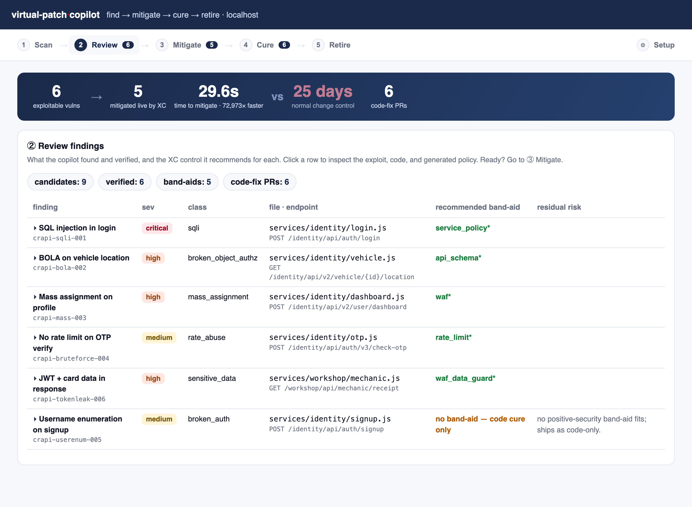
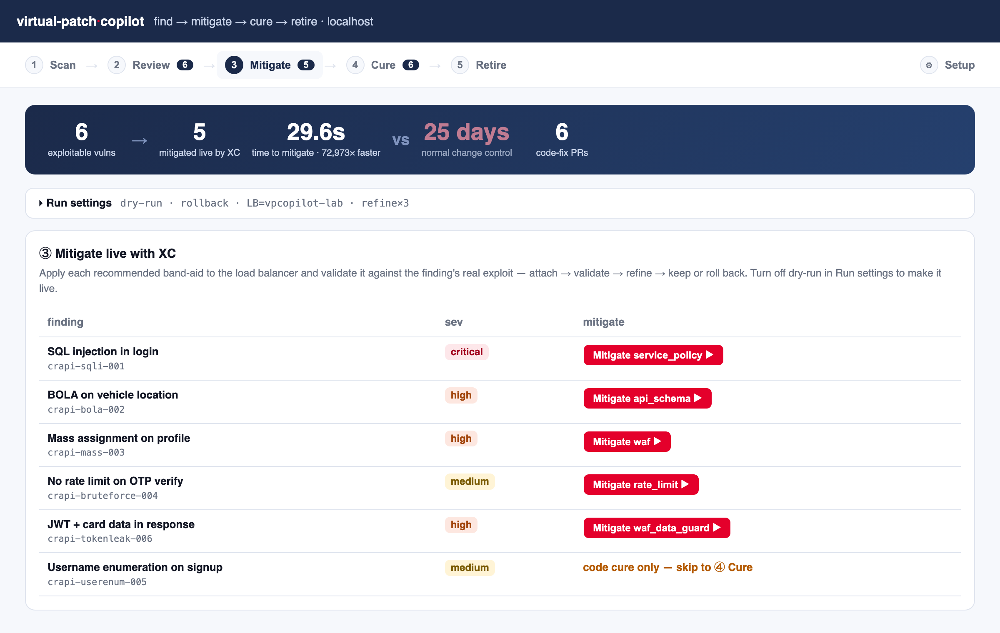
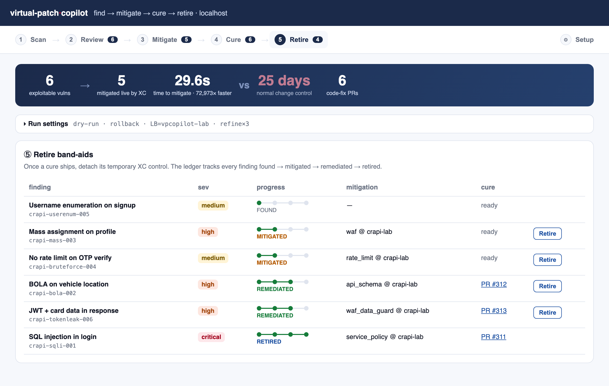
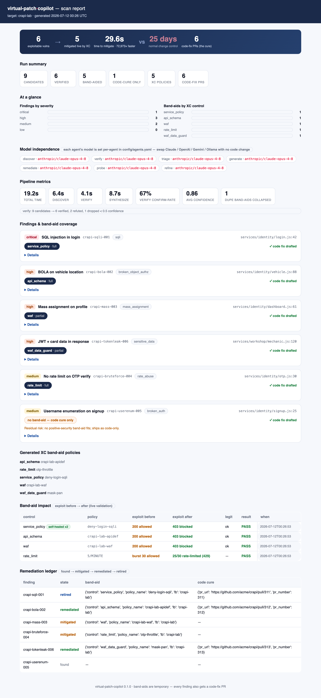

# virtual-patch-copilot

[](https://github.com/henleda/virtual-patch-copilot/actions/workflows/ci.yml)
[](LICENSE)


An agent pipeline that **finds application vulnerabilities, mitigates each live with the right
F5 Distributed Cloud (XC) control, and drafts the real code fix** — so the exposure window
between "AI found a vuln" and "the code fix ships" collapses from weeks to minutes, with a human
in the loop and everything reversible.

The band-aid buys time; the PR is the cure. Every mitigated finding also gets a code-fix PR, and
the copilot **validates its own band-aid against the finding's real exploit** — refining until the
exploit is actually blocked — so it never claims a fix that doesn't work.

It is **model-independent**: every agent's model is chosen in `config/agents.yaml`, so you run it
on Claude, OpenAI, Gemini, or local Ollama — per agent or globally — with no code change.



## How it works

```
repo ─▶ discover ─▶ verify ─▶ triage ─▶ generate ─┬▶ apply  (XC band-aid: snapshot → self-test →
        (find)    (refute)  (route)   (XC config) │         attach → validate → refine → keep/rollback)
                                       remediate  └▶ open PR (the real code fix — the cure)
```

- **discover → verify** find candidates and adversarially refute the weak ones (calibrated,
  severity-weighted confidence gate; each distinct vuln reported once, with its effective endpoint).
- **triage** routes each finding to the strongest control: `service_policy` · `waf` ·
  `waf_data_guard` · `api_schema` · `malicious_user` · `bot_defense` · `rate_limit` — or
  code-only when no band-aid fits.
- **apply** creates/attaches the control to a live LB behind a human gate, then **validates it
  against the finding's own exploit** (a probe agent derives setup/exploit/legit requests). If the
  policy doesn't block, the **refiner** diagnoses and retries until it does — or gives up honestly
  ("code fix required"). A deterministic linter catches self-defeating policies before any live
  round-trip.
- **remediate** drafts the code cure as a GitHub PR. A **ledger** tracks every finding
  `found → mitigated → remediated → retired`, and **retire** detaches the band-aid once the cure
  merges.

Guardrails throughout: protected LBs/policies refuse mutation unless opted in; every apply
snapshots first and rolls back on failure.

## Try it in 2 minutes (no cloud, no keys)

```bash
pip install -e ".[console]"
python3 demo/build_demo_out.py            # curated dataset — the full story, offline
VPCOPILOT_OUT=demo/out vpcopilot console  # http://127.0.0.1:8787
```

Open `demo/out/report.html` directly for the shareable dashboard. See **[docs/DEMO.md](docs/DEMO.md)**
for the guided walkthrough (and the live, behind-XC path).

**Want to run it for real on a safe repo?** Point it at a known-vulnerable OSS app (VAmPI / OWASP
crAPI) before your own — a scan needs only a model key and makes no changes. See
**[docs/TRY_IT.md](docs/TRY_IT.md)**.

## Quickstart (live)

```bash
pip install -e ".[deploy,console,dev]"   # deploy=GitHub PRs, console=web UI, dev=tests
cp .env.example .env                      # model key(s) + XC creds + GITHUB_TOKEN
# edit config/agents.yaml to pick models per agent
vpcopilot console                         # scan, apply, PR, retire — all from the UI
#   or headless:
vpcopilot scan /path/to/app-repo --out out
```

`scan` writes `out/` (`findings.json`, `triage.json`, `policies/*.json`, code-fix PR drafts,
`report.html`) and performs **no** XC or GitHub writes — safe to run anywhere. Live changes happen
only in `apply` / `pr` / `retire`, behind the gate. Full command reference: **[docs/USAGE.md](docs/USAGE.md)**.

## The console

A guided flow that follows the lifecycle — a persistent hero band (N exploitable → mitigated live
in seconds vs. change-control days) sits on top of five steps:

1. **Scan** — point at a repo; read-only, safe.
2. **Review** — findings + the recommended XC control; click a row to inspect exploit / code / policy.
3. **Mitigate** — apply each band-aid live; the refiner streams `before 200 → after 403 BLOCKED`
   with a *self-healed in N attempts* / *unfixable → ship the code fix* badge.
4. **Cure** — open the code-fix PR for each finding.
5. **Retire** — the four-state ledger track; detach a band-aid once its cure merges.

Credentials, XC status, the per-agent model wiring, and the shareable HTML report live under
**Setup**.

**③ Mitigate** — apply each band-aid and watch it validate:



**⑤ Retire** — the four-state ledger (here `crapi-sqli-001` walked all the way to *retired*):



Every scan also drops a standalone, shareable **`report.html`** — the same hero plus at-a-glance
bars, the self-heal (`200 → 403`, *self-healed ×2*), the rate-limit behavioral proof, and the
ledger:



## Docs

| File | What |
|---|---|
| [docs/TRY_IT.md](docs/TRY_IT.md) | try it on safe repos (VAmPI / crAPI) before your own |
| [docs/DEMO.md](docs/DEMO.md) | 5-minute runbook (offline + live) |
| [docs/USAGE.md](docs/USAGE.md) | full CLI + console reference |
| [DESIGN.md](DESIGN.md) | architecture |
| [MODELS.md](MODELS.md) | cross-provider model notes |
| [docs/QUALITY_PLAN.md](docs/QUALITY_PLAN.md) | quality burn-down |

## Contributing

PRs welcome — `pip install -e ".[deploy,console,dev]"`, then `ruff check src tests` and
`pytest -m "not live and not bench"` (the suite runs entirely against in-memory fakes; no keys or
cloud needed). See [CONTRIBUTING.md](CONTRIBUTING.md).

## Security & responsible use

This is a **dual-use security tool**. `scan` is read-only; `apply` / `pr` / `retire` change live
systems and validation fires real exploits. Use it only against systems you own or are explicitly
authorized to test. Reporting and guardrails: [SECURITY.md](SECURITY.md).

## License

[Apache-2.0](LICENSE). Not affiliated with, endorsed by, or sponsored by F5, Inc.; "F5" and
"F5 Distributed Cloud" are trademarks of F5, Inc., referenced only to describe interoperation via
their public APIs.
