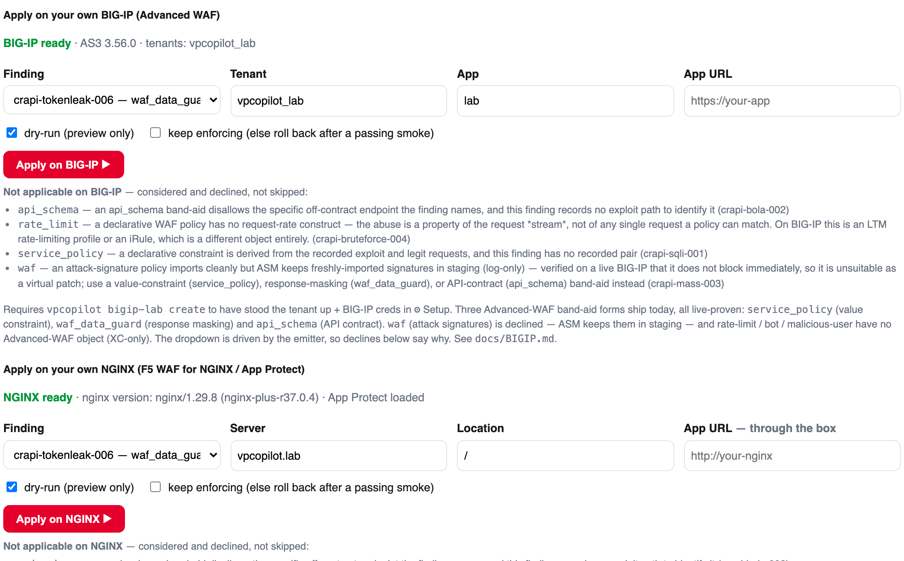
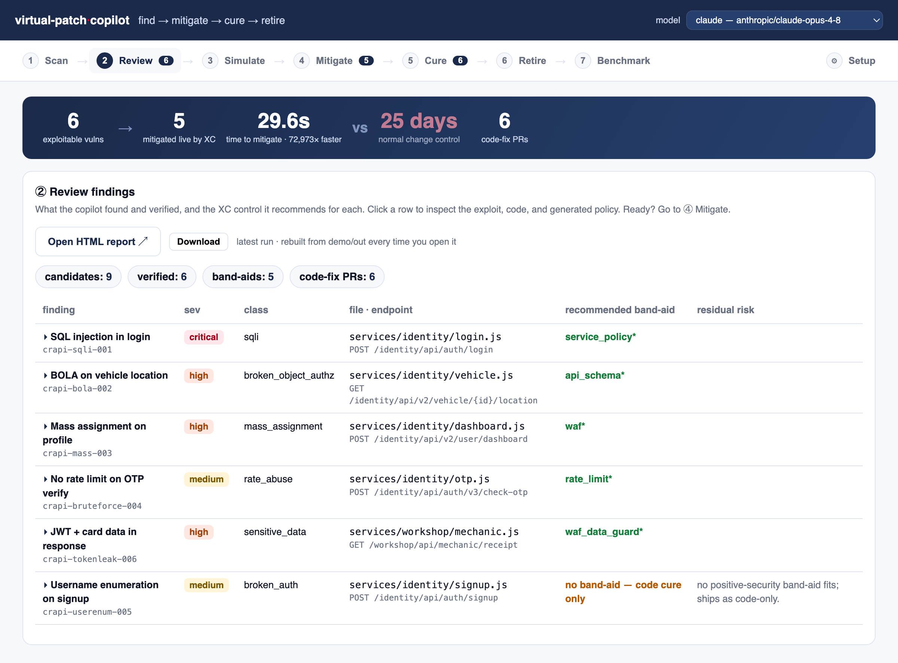
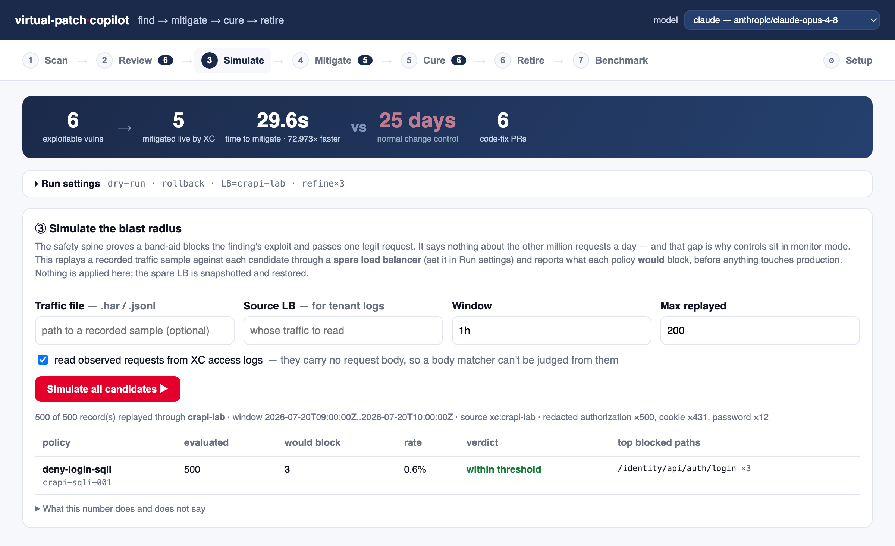
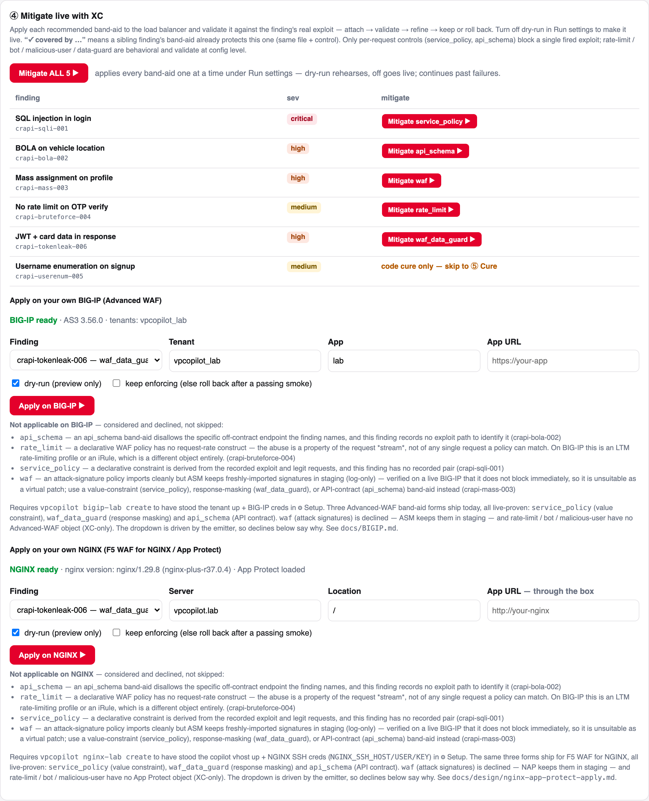
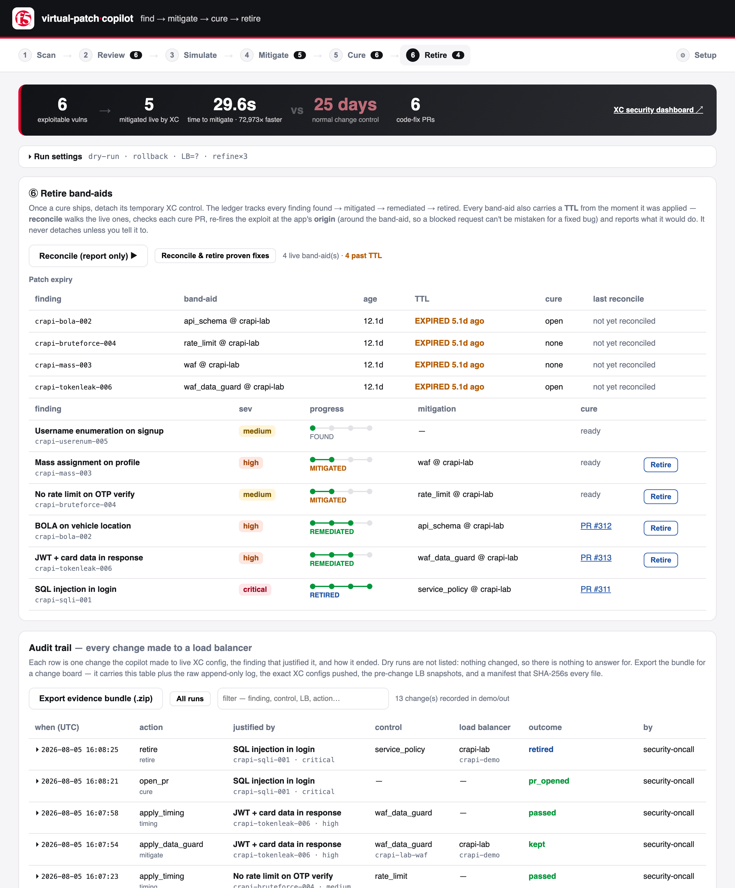
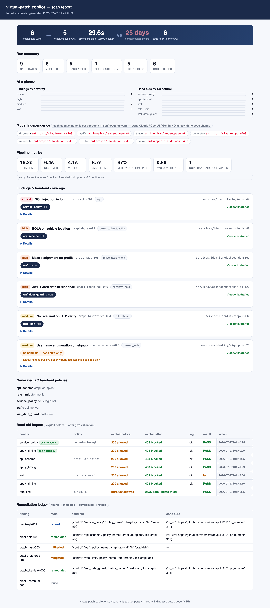

# virtual-patch-copilot

[](https://github.com/henleda/virtual-patch-copilot/actions/workflows/ci.yml)
[](LICENSE)


An agent pipeline that **finds application vulnerabilities, mitigates each live with the right
F5 Distributed Cloud (XC) control, and drafts the real code fix** — so the exposure window
between "AI found a vuln" and "the code fix ships" collapses from weeks to minutes, with a human
in the loop and everything reversible.

Three properties make it something you could actually point at production:

- **The band-aid buys time; the PR is the cure.** Every mitigated finding also gets a code-fix PR,
  and a ledger tracks each one `found → mitigated → remediated → retired` so a temporary control
  never quietly becomes permanent.
- **It proves its own work.** Each band-aid is validated against the finding's *real exploit*. If
  the policy doesn't block, the refiner diagnoses and retries until it does — or gives up honestly
  ("code fix required"). It never claims a fix that doesn't work.
- **Every change to a load balancer is on the record.** What changed, in which XC namespace, *which
  vulnerability justified it*, whether it's still live, and who ran it — exportable as a
  SHA-256-manifested evidence bundle for a change board. See **[docs/AUDIT.md](docs/AUDIT.md)**.

**One finding, every enforcement point.** The band-aid is a *declarative* policy, so the same finding
is mitigated on whichever F5 WAF you already run — **F5 Distributed Cloud**, **BIG-IP Advanced WAF**,
or **F5 WAF for NGINX (App Protect)**. The copilot emits it for each, applies it on your own box
behind the same human gate, and proves it against the finding's real exploit (all three forms —
value-constraint, response-masking, and API-contract — are proven on live BIG-IP and NGINX+App-Protect
appliances). Written for the admins who run those boxes: **[docs/BIGIP.md](docs/BIGIP.md)** ·
**[docs/NGINX.md](docs/NGINX.md)**.



It is **model-independent**: every agent's model is chosen in `config/agents.yaml`, so you run it
on Claude, OpenAI, Gemini, or local Ollama — per agent or globally — with no code change.



## How it works

```
repo ─▶ discover ─▶ verify ─▶ triage ─▶ generate ─┬▶ apply  (XC band-aid: snapshot → self-test →
        (find)    (refute)  (route)   (XC config) │         attach → validate → refine → keep/rollback)
                                       remediate  └▶ open PR (the real code fix — the cure)
                                                        │
                          ledger: found → mitigated → remediated → retire (detach the band-aid)
                          audit:  every mutating step, appended and exportable as evidence
```

- **discover → verify** find candidates and adversarially refute the weak ones (calibrated,
  severity-weighted confidence gate; each distinct vuln reported once, with its effective endpoint).
  The input can be a repo, a **CVE / advisory id** (resolved via OSV.dev), **dependency manifests**,
  or an **OpenAPI spec** — alone or combined (a spec against a repo also reports spec-vs-code drift).
- **triage** routes each finding to the strongest control: `service_policy` · `waf` ·
  `waf_data_guard` · `api_schema` · `malicious_user` · `bot_defense` · `rate_limit` — or
  code-only when no band-aid fits.
- **apply** creates/attaches the control to a live LB behind a human gate, then **validates it
  against the finding's own exploit** (a probe agent derives setup/exploit/legit requests). If the
  policy doesn't block, the **refiner** diagnoses and retries until it does. A deterministic linter
  catches self-defeating policies before any live round-trip.
- **remediate** drafts the code cure as a GitHub PR; **retire** detaches the band-aid once the cure
  merges.

Guardrails throughout: protected LBs/policies refuse mutation unless opted in; every apply
snapshots first and rolls back on failure; dry-run is the default in the console.

**Where it stands.** All seven controls apply live against a real XC tenant, each snapshot →
self-test → attach → validate → keep-or-roll-back. On the vendored Nimbus fixture the pipeline
scores **9/9 discovery recall and 9/9 triage accuracy** ([bench/BASELINE.md](bench/BASELINE.md)).
A matched three-way on VAmPI — Claude, GPT-4.1, and a local Qwen3-Coder 30B via Ollama, same code
and same target, every band-aid applied live behind XC — is in
[benchmarks/compare-vampi-three-way.md](benchmarks/compare-vampi-three-way.md): zero failed applies
on all three, with Claude leading on verified findings and real single-request blocks.

## Try it in 2 minutes (no cloud, no keys)

```bash
pip install -e ".[console]"
python3 demo/build_demo_out.py            # curated dataset — the full story, offline
VPCOPILOT_OUT=demo/out vpcopilot console  # http://127.0.0.1:8787
```

Open `demo/out/report.html` directly for the shareable dashboard. See **[docs/DEMO.md](docs/DEMO.md)**
for the guided walkthrough (and the live, behind-XC path).

**Want to run it for real on a safe repo?** Point it at a known-vulnerable OSS app (VAmPI / OWASP
crAPI) before your own — a scan needs only a model key and makes no changes. See
**[docs/TRY_IT.md](docs/TRY_IT.md)**.

## Quickstart (live)

```bash
pip install -e ".[deploy,console,dev]"   # deploy=GitHub PRs, console=web UI, dev=tests
cp .env.example .env                      # model key(s) + XC creds + GITHUB_TOKEN
# edit config/agents.yaml to pick models per agent
vpcopilot console                         # scan, apply, PR, retire — all from the UI
#   or headless:
vpcopilot scan /path/to/app-repo --out out
vpcopilot simulate --out out --from-tenant   # blast radius before you apply
vpcopilot export --out out                # evidence bundle (.zip) of every change made to an LB
```

`scan` writes `out/` (`findings.json`, `triage.json`, `policies/*.json`, code-fix PR drafts,
`report.html`, and a `run.json` provenance manifest) and performs **no** XC or GitHub writes — safe
to run anywhere. Live changes happen only in `apply` / `pr` / `retire`, behind the gate. Full command
reference: **[docs/USAGE.md](docs/USAGE.md)**.

## The console

An **F5-branded**, guided flow that follows the lifecycle — a persistent hero band (N exploitable →
mitigated live in seconds vs. change-control days) sits on top of six steps:

1. **Scan** — point at a repo (a CVE, dependency manifests, or an OpenAPI spec live under *Other
   inputs*); read-only, safe. The log holds the whole transcript in a scrollable box, so a long run
   can be read end-to-end while it's still going.
2. **Review** — findings + the recommended XC control (with the CWE / OWASP-API mapping); click a row
   to inspect exploit / code / policy.
3. **Simulate** — replay a recorded traffic sample against each candidate through a spare LB and see
   what it *would* block before anything touches production. A policy over the false-positive
   threshold warns at the gate and needs an explicit, audited override.
4. **Mitigate** — one click per finding (or *Mitigate ALL*) applies each band-aid live: attach →
   validate against the finding's real exploit → self-heal or ship the code fix. Dry-run rehearses
   first.
5. **Cure** — open the code-fix PR for each finding.
6. **Retire** — patch-expiry (each band-aid carries a TTL) and a **reconcile** loop that re-fires the
   exploit at the origin once the cure PR lands, the four-state ledger, and the **audit trail** of
   every change made to a load balancer — exportable as an evidence bundle.

The everyday path stays uncluttered: secondary inputs, tuning knobs, and integration panels sit
behind *Advanced* disclosures. A model-comparison **Benchmark** step and a live model switcher appear
in **advanced mode** — set `VPCOPILOT_ADVANCED`, or keep more than one `config/agents*.yaml`.

The shareable HTML report opens (or downloads) from **Review** and from **Setup** — it is rebuilt
from the current run dir on every open, so it's always the latest run. Credentials, XC status, and
the per-agent model wiring live under **Setup**.

**③ Simulate** — replay recorded traffic against each candidate and see what it *would* block
before anything is applied. Here the SQLi service policy is surgical: 3 blocks in 500 recorded
requests, all of them attacks on the login endpoint:



**④ Mitigate** — one click per finding (or *Mitigate ALL*) applies and validates each band-aid live
on XC. The same step also carries **Apply on your own BIG-IP** and **Apply on your own NGINX** panels
(driven by the emitter, so every form is selectable and every decline says why) — the identical
band-aid, on the appliance you already run:



**⑥ Retire** — patch-expiry (band-aids past their TTL, flagged for reconcile), the four-state ledger
(here `crapi-sqli-001` walked all the way to *retired*), and under it the audit trail: each change
tied to the vulnerability that justified it, the LB and XC namespace it touched, whether it's still
live, and who ran it. Dry runs are absent by design — nothing changed, so there is nothing to answer
for.



Every scan also drops a standalone, shareable **`report.html`** — same F5 branding, the same hero,
the at-a-glance bars (severity, XC control, and the OWASP-API grouping), pipeline metrics, and —
further down — per-finding band-aid coverage with the self-heal (`200 → 403`, *self-healed ×2*) and
the ledger:



## Docs

| File | What |
|---|---|
| [docs/TRY_IT.md](docs/TRY_IT.md) | try it on safe repos (VAmPI / crAPI) before your own |
| [docs/DEMO.md](docs/DEMO.md) | 5-minute runbook (offline + live) |
| [docs/USAGE.md](docs/USAGE.md) | full CLI + console reference |
| [docs/BIGIP.md](docs/BIGIP.md) | using it with your own BIG-IP (Advanced WAF) — written for BIG-IP admins |
| [docs/NGINX.md](docs/NGINX.md) | using it with your own NGINX + App Protect — written for NGINX admins |
| [docs/AUDIT.md](docs/AUDIT.md) | the audit trail and the evidence export — what is recorded, and how to verify a bundle |
| [DESIGN.md](DESIGN.md) | architecture |
| [MODELS.md](MODELS.md) | cross-provider model notes |
| [docs/QUALITY_PLAN.md](docs/QUALITY_PLAN.md) | quality burn-down |
| [docs/PROJECT_STATE.md](docs/PROJECT_STATE.md) | running handoff — current state, benchmark results, open threads |

## Contributing

PRs welcome — `pip install -e ".[deploy,console,dev]"`, then `ruff check src tests` and
`pytest -m "not live and not bench"` (the suite runs entirely against in-memory fakes; no keys or
cloud needed). See [CONTRIBUTING.md](CONTRIBUTING.md).

## Security & responsible use

This is a **dual-use security tool**. `scan` is read-only; `apply` / `pr` / `retire` change live
systems and validation fires real exploits. Use it only against systems you own or are explicitly
authorized to test. The audit trail is a record of what this tool did — it is not tamper-evident,
and it is evidence for a human reviewer rather than a compliance certification
([docs/AUDIT.md](docs/AUDIT.md) is explicit about the limits). Reporting and guardrails:
[SECURITY.md](SECURITY.md).

## License

[Apache-2.0](LICENSE). Not affiliated with, endorsed by, or sponsored by F5, Inc.; "F5" and
"F5 Distributed Cloud" are trademarks of F5, Inc., referenced only to describe interoperation via
their public APIs.
